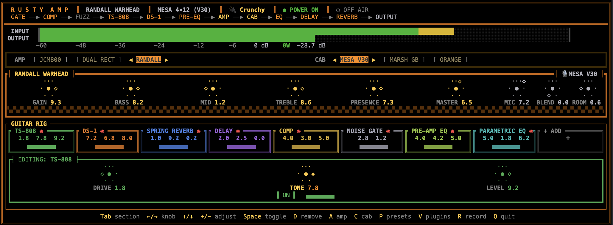

# 🎸 rusty-riff

**A complete guitar amp and pedalboard rig that runs right in your terminal.**

Plug in your guitar, pick an amp, and play. rusty-riff recreates classic tube and
solid-state amplifiers, a full board of stompbox effects, and multi-mic'd
cabinets — all driven from a fast, keyboard-only interface with live metering. It
ships with artist-inspired presets, so you can dial in a great tone in seconds and
tweak from there.



## Demo


## Motivation

Every person who plays guitar knows the routine: boot up heavyweight software,
load a plugin for amp and cabinet simulation, and wait. That software is great for
professional studio work, but what if you just want to play your instrument
without any complications? It's usually platform-locked, the licenses cost real
money, and they limit how many devices you can authorize.

rusty-riff is a complete guitar rig in a single terminal binary. No installer. No
license server. No subscription. No "activate this device". You build one tiny
file, plug in your guitar, and you're playing on any platform, right in your
terminal.

> [!IMPORTANT]
> rusty-riff does not try to replace professional studio software.

Under the hood it's real DSP, not a toy: filter and nonlinear stages for each amp,
synthesized or loaded impulse responses for the cabinets, and a full real-time
signal chain running on a single audio thread. Every bypassable stage can be
toggled independently while you play.

## Highlights

- 🔊 **7 amplifiers** — Marshall JCM800 & Plexi, Mesa Dual Rectifier, Randall
  Warhead, Vox AC30, Hiwatt DR103, and Fender Twin Reverb, switchable while you
  play
- 📦 **6 cabinets + your own IRs** — four closed 4×12s (Mesa, Marshall, Orange,
  WEM/Fane) and two open-back 2×12s (Vox Alnico, Fender Jensen), plus external
  `.wav` IR loading
- 🎛️ **A full pedalboard** — noise gate, whammy pitch shifter, auto-wah,
  compressor, fuzz (Big Muff / Fuzz Face / Tone Bender MkII), Tube Screamer, DS-1,
  ML-2 Metal Core, graphic EQ, parametric EQ, Uni-Vibe, flanger, chorus, phaser,
  tremolo/vibrato, digital or tape delay, and stereo reverb; add, remove, reorder,
  and bypass on the fly
- 🎧 **Stereo processing** — width from the cab, delay, and reverb
- 💾 **Ready-made presets** — artist-inspired starting points you can tweak, save,
  and export
- 🔌 **CLAP plugin host** — drop a third-party CLAP effect into the chain and tweak
  its parameters from the TUI
- 🎚️ **AU amp host (macOS)** — load an Audio Unit amp sim as an amp-position
  override, either amp+cab or amp-only
- 🎵 **Built-in tuner** — a chromatic tuner with a ±cents needle and a live note
  spectrum
- 🥁 **Practice metronome** — an adjustable-tempo click that never bleeds into your
  recordings
- 🎼 **Jam-along timeline** — load MP3/WAV/FLAC backing tracks, loop a section,
  record dry takes, re-amp them through the current rig, and export the processed
  guitar to WAV
- 🗂️ **Portable sessions** — save a whole project folder with tracks, positions,
  gains, and rig state
- 🪟 **Toggleable panels** — show or hide the pedalboard, amp & cabinet panel, and
  timeline with `1`/`2`/`3`
- ⏺️ **One-key recording** straight to a stereo WAV file
- 🖥️ **Cross-platform** — runs on macOS, Windows, and Linux

## Build from source

Requires Rust 1.96+.

```bash
git clone https://github.com/cesaraaron/rusty-riff
cd rusty-riff
cargo run --release
```

Use `--release` when playing: a debug build can underrun the audio callback.

Pre-built binaries, once published, are attached to this repository's
[Releases](https://github.com/cesaraaron/rusty-riff/releases). On macOS you'll
need to clear the unsigned-binary quarantine flag:

```bash
xattr -d com.apple.quarantine rusty-riff
```

## What you need

- **A guitar and an audio interface** with a high-impedance instrument input (e.g.
  Focusrite Scarlett)
- **Speakers or headphones** — for the full stereo image, use stereo output

## Controls

The app is keyboard-only. Press `K` at any time for the in-app cheat sheet. A few
of the essentials:

| Key | Action |
| --- | ----- |
| `1` / `2` / `3` / `4` | Focus the chain, amp, timeline, or pedals (press again to hide) |
| `Tab` | Cycle amp/cab or pedals within the panel |
| `←` / `→` | Move inside the focused panel |
| `↑` / `↓` or `+` / `-` | Select a knob / adjust its value |
| `[` / `]` | Move the selected stage earlier or later in the chain |
| `Space` | Bypass the focused stage |
| `A` / `C` | Open the amp / cabinet model browser |
| `I` / `X` | Open the IR browser / bypass the external IR |
| `W` | Toggle the studio-master width (neutral / wide) |
| `P` / `S` | Open the preset browser / save the current rig |
| `J` | Open the session browser (new / save / load) |
| `T` / `M` | Chromatic tuner / practice metronome |
| `R` | Arm or stop a dry take |
| `V` | Open the CLAP plugin browser |
| `K` | Open this key reference |

## Project docs

The user-facing guide lives in the app itself (`K`). For the engineering side, see
the design and as-built notes in the repository:

| Document | What's in it |
| -------- | ------------ |
| [`fidelity-plan.md`](fidelity-plan.md) | Amp/cab/pedal fidelity roadmap and acceptance criteria |
| [`fidelity-implement.md`](fidelity-implement.md) | As-built record, invariants, and review findings |
| [`docs/fidelity-references.md`](docs/fidelity-references.md) | Evidence matrix for historical gear claims |
| [`timeline-sessions-plan.md`](timeline-sessions-plan.md) | Timeline, raw takes, export, and sessions design |
| [`timeline-sessions-implement.md`](timeline-sessions-implement.md) | Timeline/session as-built notes |

## Development

Local build, test, and code-convention notes are in
[`CONTRIBUTING.md`](CONTRIBUTING.md). In short:

```bash
cargo run --release        # play
cargo test --all-features  # unit + snapshot tests
cargo fmt --check
cargo clippy --all-targets --all-features -- -D warnings
```

## License

Apache 2.0. See [`LICENSE`](LICENSE) and [`NOTICE`](NOTICE) for attribution.
