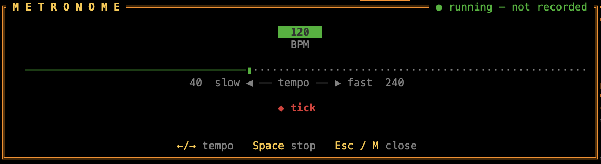

## Tuner (<kbd>T</kbd>) {#tuner}

<figure class="shot">
  
<i></i><i></i><i></i>

  
</figure>

Press <kbd>T</kbd> to open the chromatic tuner. While it's open the **entire rig is bypassed** — every pedal, the amp, and the cabinet are taken out of the path and the dry guitar passes straight to the output, so you hear (and tune against) a clean signal. Pitch is estimated with the McLeod normalised square-difference function (NSDF), accurate to a few cents.

The tuner shows:

- **The detected note** — large, with its octave (e.g. `E2`), green when in tune.
- **A ±cents needle** — `♭ ◄ … centre … ► ♯`. Left when flat, right when sharp; green within ±5 cents, amber within ±15, red beyond.
- **A verdict** — `IN TUNE`, `TUNE UP ▲` (flat), or `TUNE DOWN ▼` (sharp), plus the raw frequency in Hz.
- **A live note spectrum** — a log-spaced magnitude display from ~60 Hz to ~1.2 kHz, with the played fundamental highlighted.

Standard tuning reference:
<b>E2</b> 82.41 Hz · <b>A2</b> 110.00 · <b>D3</b> 146.83 · <b>G3</b> 196.00 · <b>B3</b> 246.94 · <b>E4</b> 329.63.
Press <kbd>Esc</kbd> / <kbd>T</kbd> to close and restore the full rig.

## Metronome (<kbd>M</kbd>) {#metronome}

<figure class="shot">
  
<i></i><i></i><i></i>

  
</figure>

Press <kbd>M</kbd> to open the practice metronome. It plays a steady click through your monitor so you can lock in your timing while you play — the rig stays fully live, so you keep hearing your tone alongside the beat.

The modal shows:

- **The current tempo** — a big BPM readout that turns green while the click is running.
- **A tempo slider** — from **40** to **240 BPM**. Adjust it with <kbd>←</kbd> / <kbd>→</kbd> (or <kbd>↑</kbd> / <kbd>↓</kbd>), one BPM at a time.
- **A start/stop toggle** — <kbd>Space</kbd> (or <kbd>Enter</kbd>) turns the click on and off.

The metronome keeps ticking after you close the modal, so you can dial in a tempo, press <kbd>Esc</kbd> / <kbd>M</kbd>, and play along with the full board and meters on screen. Re-open it any time to change tempo or stop the click.

<b>Never on the tape.</b> The click is mixed into the monitor output <em>after</em> the recording tap, so an active metronome is <b>never captured</b> in your WAV — you can practise to the beat and record a clean take at the same time.

## Practice & timeline (<kbd>B</kbd>) {#practice}

Play along with one or more backing tracks and loop the hard bits. Press <kbd>B</kbd> to open the **Import track** browser and pick an audio file — **MP3, WAV, or FLAC** — from `~/Music`, `~/Desktop`, the current directory, `$RUSTY_AMP_PRACTICE_DIR`, or a path you type in. Each import is added as a **new track at the current playhead**, and you can stack as many as you like (up to a bounded track limit). Files are decoded and resampled to your interface's rate off the audio thread, so the TUI never stalls.

The **timeline** is the scrollable pane that shows a transport line followed by one row per track, each with its name, type, mute LED, gain, a mini waveform and the shared playhead:

- **Transport** — press <kbd>3</kbd> to focus the timeline, then <kbd>Space</kbd> on the transport row to play/pause.
- **Select a row** — <kbd>↑</kbd>/<kbd>↓</kbd> walks the transport and the tracks.
- **Seek** — <kbd>←</kbd>/<kbd>→</kbd> moves by the current step; <kbd>+</kbd>/<kbd>−</kbd> cycle the step through **1 / 5 / 10 / 30&nbsp;s**.
- **Loop a section** — park the playhead and press <kbd>[</kbd> for the in-point and <kbd>]</kbd> for the out-point; <kbd>L</kbd> toggles looping. The loop region is shaded on the timeline.
- **Mute a track** — select its row and press <kbd>Space</kbd> (the LED turns hollow).
- **Track gain** — select a row and press <kbd>G</kbd>; on an import this is the **monitor volume**, on a raw take it is the **pre-rig level** (it changes how the amp reacts, not just how loud the result is).
- **Remove a track** — select it and press <kbd>Delete</kbd>/<kbd>Backspace</kbd>. Source files on disk are left alone.

<b>Imports are monitor-only.</b> Imported backing audio is summed into your monitor <em>after</em> the capture tap, so it is <b>never captured</b> in a raw take. You always record just your dry guitar.

### Hiding panels {#panels}

The screen is four numbered panels. <kbd>1</kbd> focuses the live-order ribbon (always visible), <kbd>2</kbd> the **amp &amp; cabinet** panel, <kbd>3</kbd> the **practice timeline**, <kbd>4</kbd> the guitar **pedalboard** — pressing a number again on its focused panel hides it (`1` never hides).

Hidden panels give their space back to the rest of the rig, and the number keys are the only way to switch between panels — <kbd>Tab</kbd> stays inside the focused one. The choice lasts for the session.

## Raw takes (<kbd>R</kbd>) {#recording}

Press <kbd>R</kbd> to arm a **new raw take**. A blinking `●REC` lamp lights up on the timeline's transport line, transport starts automatically if it was paused, and the **dry selected input channel** is captured from the current playhead — *before* the gate, pedals, amp, cab and output limiter. Press <kbd>R</kbd> again (or let a loop reach its out-point) to stop; the take is placed on the timeline as its own row.

Raw takes are **non-destructive and re-ampable**: the timeline stores the dry guitar, and the currently selected pedals, amp and cabinet render it live. Change a knob or switch amp model and the same take changes with it. Each take is a new row — recording again never overwrites the previous one.

  
⏸○REC00:00 / 00:00

  

  
00:00

  
<button class="rec__btn">●Record</button>

  

<b>Interactive demo</b> — hit <em>Record</em> to see the on-air flow; nothing is captured here.

<b>No surprise files.</b> Stopping a take does <b>not</b> write a processed WAV to your home directory. Dry captures are held in a recoverable session cache and placed on the timeline; a portable session save and a guitar-only final WAV export are next.

<b>Monitor-only, like the metronome.</b> Imports, the metronome click and already-recorded takes are summed into your monitor <em>after</em> the capture tap, so a new take contains only your live dry guitar.

## Sessions (<kbd>J</kbd>) {#sessions}

A **session** is a portable project folder, not a rig snapshot. Press <kbd>J</kbd> to open the session browser:

- <kbd>N</kbd> — **new** empty session.
- <kbd>S</kbd> — **save** to the current session folder (prompts for a name the first time).
- <kbd>A</kbd> — **save as** a typed name.
- <kbd>Enter</kbd> — **load** the highlighted session (or **restore** a recoverable take).
- <kbd>D</kbd> — **delete** the highlighted session folder (or **discard** a recoverable take).

Unsaved dry takes are kept in a recovery cache. If any remain from a previous run, the browser opens on launch with a **recoverable takes** section — press <kbd>Enter</kbd> to bring one into the current session, or <kbd>D</kbd> to discard it. A take is removed from recovery once a session save has copied it in.

Sessions are stored under `~/.config/rusty-amp/sessions/<name>/` and bundle the timeline (tracks, positions, gains, mutes), the playhead/loop and seek step, the metronome, and the built-in rig. Imported originals and your dry raw takes are copied into the project's `audio/` folder, and the active external IR into `irs/`, so the folder is self-contained.

<b>Sessions vs presets.</b> A <a href="presets.html">preset</a> is a reusable <b>rig</b> snapshot (pedals/amp/cab settings) that applies without touching your timeline. A <b>session</b> is the whole project — rig plus tracks and transport. Loading a session replaces both; loading a preset only replaces the rig inside the current session.

<b>External plugins.</b> The built-in rig, the external IR, and all timeline/transport state are restored. Third‑party AU/CLAP binaries can't be made portable by copying files, so a session records which one was loaded but restores the built-in rig instead and tells you what wasn't restored; reload it manually.

## Export (<kbd>E</kbd>) {#export}

Press <kbd>E</kbd> with the timeline focused to render your **guitar takes** to a WAV. Type a destination path (prefilled with `<session>.wav`) and press <kbd>Enter</kbd>; a progress modal tracks the render and <kbd>Esc</kbd> cancels it.

- **Guitar takes only.** The unmuted raw takes are summed into the take bus, placed at their timeline starts and levels, and processed once through the current rig. Imported backing audio, the metronome, the click and live (unrecorded) guitar are **excluded**. The delay/reverb tail is included, then capped.
- **Offline & deterministic.** The render runs on a worker thread with its own rig built from a frozen snapshot, so moving knobs mid-render does not change the result. Output is stereo 32-bit float at the project sample rate. Muted takes are skipped; the loop region does not truncate the export.
- **External rig included.** A loaded external IR is re-loaded at the export rate; a loaded CLAP insert is re-instantiated with its captured opaque state; a loaded AU amp is re-instantiated with its parameter snapshot (plus the amp-only/cab routing and latency). If an AU is loaded but its state cannot be captured, export refuses with a clear message rather than rendering something that would not match.

<b>Best-effort parity.</b> Plugins that keep state outside their exposed parameters or opaque state blob may render slightly differently offline. The live take bus always mirrors external plugins; the export tries to match it exactly.

